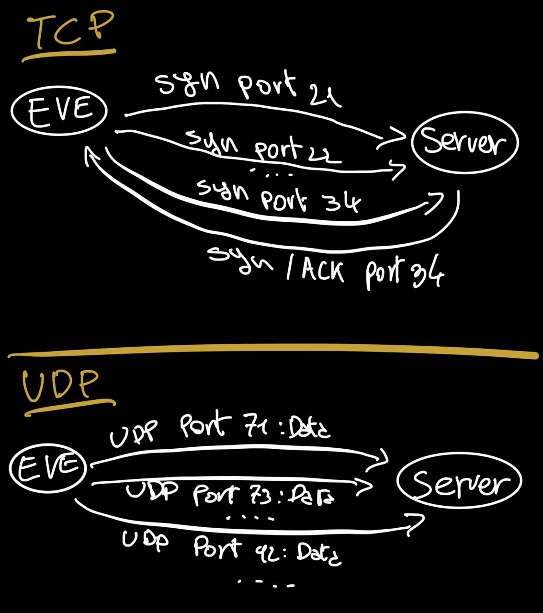
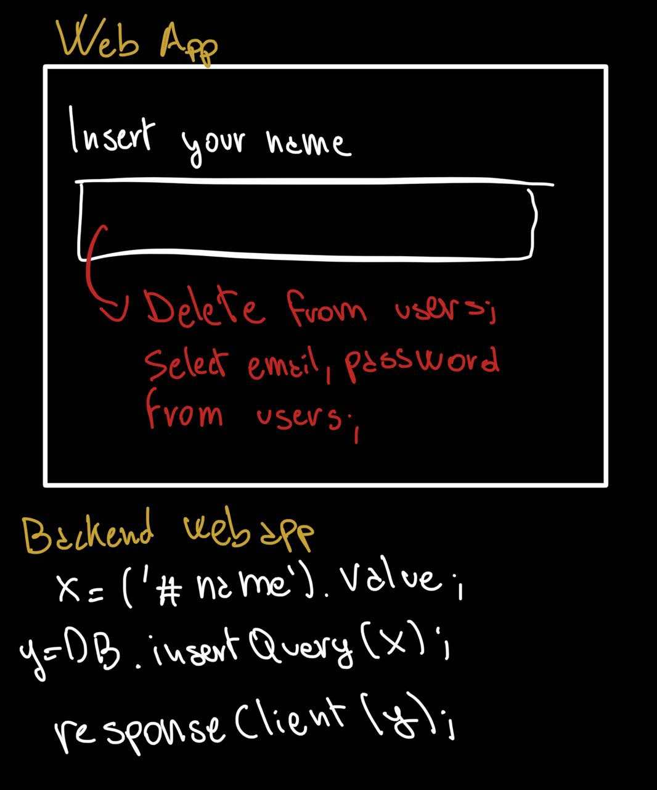

# Cyber attacks

## ARP scan
ARP is a table, usually mantained on router which store the association between MAC address and IP of every device connected.
With an ARP scan you can retrieve which devices are connected and their addresses.

## Port scanning
Finding a port open means there is an application listen for data on that, so attackers can try to enter via a vulnerability.

### TCP
It's easy on TCP, because for each communication the receiver have to respond. Then, attackers can try to create a connection to each port (65536) and save the ones whose replay with the SYN/ACK.
When no reply is received, means the port is closed or filtered by for example a Firewall.

### UDP
With UPD is harder, because most of UPD applications will not replay unless they want to share data.
Then, an attacker *might* not discover a port open. 

## Web application

### SQL injection
A webapp with an input field or similar needs to check the data inserted by user/attackers, because if the value is a query the web app might process it, provoking a lot of damnage.

*Example*: 
An attacker can easily get/update/insert/delete data without limit by simply writing a query on an input field.

### XSS attack
The server simply reflect the attackers values, usually JavaScript, against visitors who run the attackers data in their own browser.

*Example*:
Eve sends to Alice a url with an evil script inject, the script will be executed by Alice browser as soon as the server will responds.

