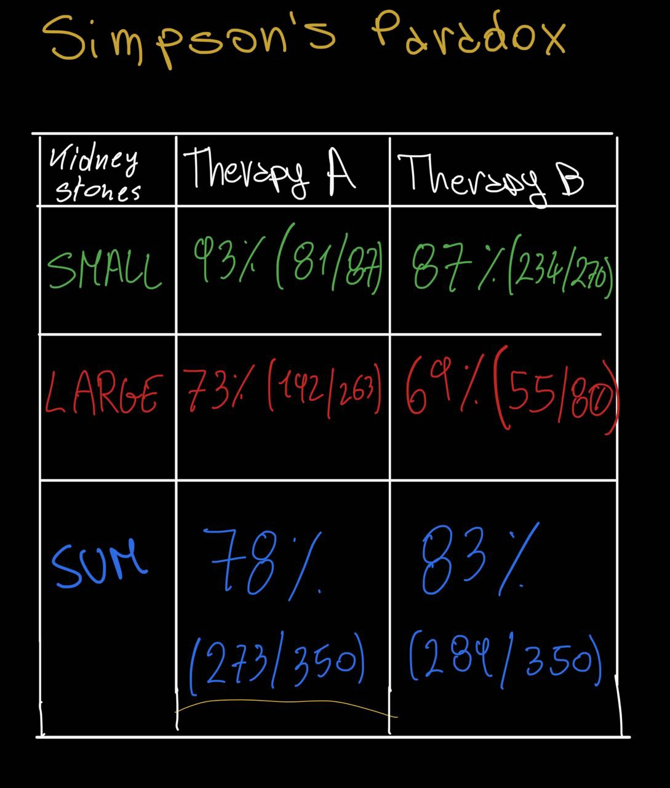
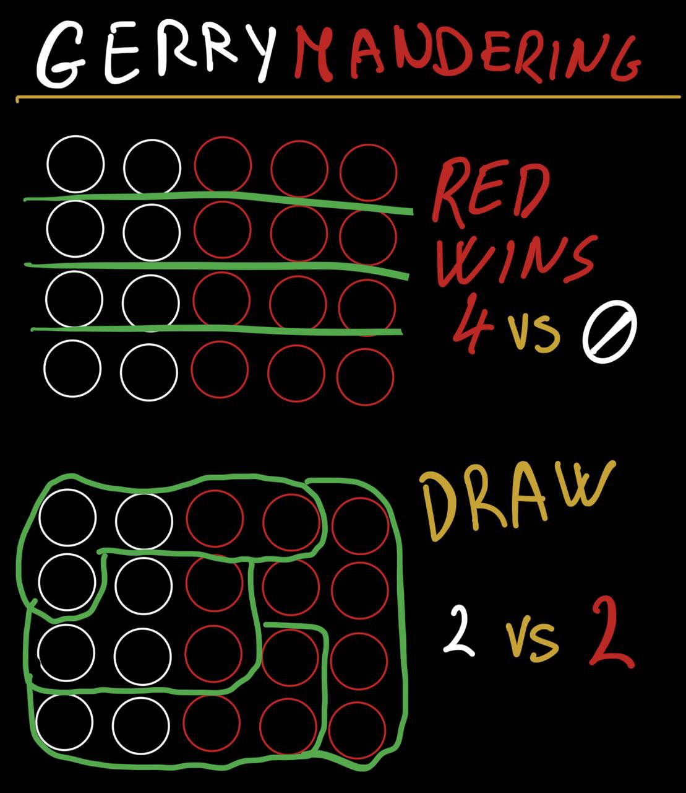

# Data Science Fallacies (to avoid)

A list of common data science fallacies to avoid.

I'll explain **the fallacies** and add an *example*.

Language: 
- 🇬🇧 English
- 🇮🇹 Italian 

-----

## CHERRY PICKING

**ENG:** Is picking a slice of data that fit the claim ignoring the bigger picture or the data that bring us different results.
Usually ignoring the entire dataset.
>*eg*: *We can't tell the global warming is fake just because in the last 5 years the temperature hasn't raisen... We have to elaborate all data (having a dataset of more than 5 years)*

**ITA:** Viene selezionata solo una partizione di dati, in modo da favorire una tesi, ignorando o nascondendo valori che potrebbero darci torto.
Spesso ignorando l'intero set di dati.
>*es*: *Non possiamo dire che il riscaldamento globale sia falso solo perché negli ultimi 5 anni la temperatura non è salita... Dobbiamo elaborare tutti i dati (avendo un dataset contenente più di 5 anni)*

## SAMPLING BIAS

**ENG**: Creating an assumption based on a favorite/unfavorite sample of the entire dataset.
>*eg*: *we survey how many university students listen to hip/hop by asking it in a classroom.. We can't assume that x% of university students like hip/hop because we have sample just a class and not the entire university*

**ITA**: Si crea un'assuzione basta su un campione favorito/sfavorito dell'intera popolazione.
>*es*:*sondiamo a quanti studenti universitari piaccia l'hip/hop chiedendolo in un'aula.. Non possiamo assumere che a x% degli studenti univesitari piaccia l'hip/hop perché abbiamo chiesto a una sola classe e non all'intera università*

## REGRESSION TOWARDS THE MEAN

**ENG**: When we assume something based on a past event.
>*eg*:*A basketball team wins the championship, the next year we can't assume it will win again, even if has a top coach etc., because in the long run there are a lot of other factors (drug scandals of players etc.)*

**ITA**: Quando assumiamo qualcosa basandoci su un evento del passato.
>*es*:*Una squadra di basket vince un campionato, il prossimo anno non possiamo assumere che vincerà di nuovo, seppur ha un coach bravissimo etc., perché alla lunga ci sono tanti altri fattori (scandali legati dalla droga dei giocatori, etc.)*

## DATA DREDGING

**ENG**: forcing a correlation of two different hypothesis basing on the similarity of the dataset.
>*eg*: *Number of people that like HipHop is the same number of people who's like icecream... No correlation between these two hypothesis, but if we have a dataset with similar numbers we (wrongly) assume it*

**ITA**: forzare una correlazione di due ipotesi diverse basandosi sulla somiglianza dei dati.
>*es*: *Numero di persone a cui piace l'HipHop è lo stesso di quello a cui piace il gelato... Non vi è correlazione tra le due ipotesi, ma se abbiamo un dataset con una somiglianza dei numeri, potremmo (erroneamente) forzare la teoria*

## FALSE CASUALITY

**ENG**: assuming that two event apparently tied are influenced between each other or one is the cause of another. 
>*eg*: *after installed a new software your pc crash, so you assume that the program is the cause... Which could be possible, but we can't be sure of that (eg. faulty component, crappy operating system like microsoft windows, etc.)*

**ITA**: assumere che due eventi apparantemente correlati siano influenzati o l'uno la causa dell'altro.
>*es*: *dopo aver installato un nuovo software il tuo pc va in cresh, quindi assumi sia colpa di quel programma... Cosa possibile, ma non possiamo esserne certi (es. componenti fisici difettosi, sistema operativo scadente come microsoft windows, etc.)*

## GAMBLER'S FALLACY (or Monte Carlo Fallacy)
My fav.

**ENG**: When an event has happened so often in the past events, so you think that on the next round will happen with a lower probability (or viceversa)... But probability is indipendent of past events
>*eg*:*You toss a coin for three times, and all the times it landed on 'head' so you (wrongly) thing that the next toss 'head' will be less likely to land (but the probability is indipendent of the past event)*

**ITA**: Quando un evento è avvenuto spesso negli eventi passati, quindi pensi che nel prossimo round avrà una probabilità minore (o viceversa).. Ma la probabilità è indipendente dagli esiti passati
>*es*:*Tirando una moneta per 3 volte, esce tutte le volte 'testa', quindi tu (erroneamente) pensi che alla quarta volta testa avrà probabilità minore*

## SIMPSON'S PARADOX

**ENG**: When a trend shows up on different subset of a dataset, but disappear or vice versa when the groups are combined
>*eg*: *On an univesity's application the percentage of ammission is 41% (of 12,763 people), which are 44% (of 8,442) males and for females there's a percentage of 35% (of 4,321).... 44 and 35 are closer to 41 but way off compared gender to gender.*

**ITA**: Quando una tendenza viene individuata su diversi sottoinsieme di un set di dati, ma scompare quando i gruppi sono sono combinati (o viceversa).
>*es*:*L'ammissione a un'università è del 41% (12,723 persone), i quali sono 44% (di 8,443) uomini, la percenutale femminile è di 35% (di 4,321)... 44 e 35 sono vicini a 41 ma molto numeri molto distanti se si compara genere con genere*

## PUBLICATION BIAS
**ENG**:Interesting research findings are more likely to be published, distorting our impression of reality
>*eg*:*Is hard to make an example, but I'll try: You make a suvery about the favourites music genre and the last question is how old are the people. Next, you find that all the people which has answered to the survey are between 21 and 22 years old; so you (wrongly) don't publish this info because is 'boring', distorting the reality (because probably older people likes a different genre)*

**ITA**: Le ricerce interessanti/variegate hanno una probabilità maggiore d'essere pubblicate, distorgendo la nostra impressione della realtà
>*es*:*E' difficile fare un esempio, ma ci provo: Fai un sondaggio di quale sia il genere musicale preferito e l'ultima domanda è quanti anni hanno tali persone di campione. Successivamente, scopri che le persone che hanno risposto al sondaggio sono tutte tra i 21 e 22 anni; quindi tu (erroneamnete) non pubblichi questo dato, poiché è 'noioso', distorgendo la realtò (perché probabilmente le persone più anziane preferiscono un genere diverso)*

## SURVIVORSHIP BIAS
**ENG**:Drawing a conlcusion from an incomplete set of data, becuase the data 'survived' some selection criteria
>*eg*: *some war aircrafts come back home after a battle, full of bullet holes everywhere except on the engine, so you decide to armour the places where the planes has been shotted because no airplane came with bullet home on the engine... But is just luck of not being hitted on the engine (you should put armour there too)*
>*eg2*: *3 of 5 university students have the best grades, you find out that those 3 students has been on the same high school... So you think that high school has a very good education.. But you should take a larger sample of students (maybe you have picked the top 3 students of that high school)*

**ITA**: Trarre una conclusione da un dataset incompleto, perché i dati sono 'soppravvissuti' ad alcuni criteri di selezione.
> *es*:*Degli aerei da guerra torna a casa dopo una battaglia, pieni di fori di proiettile ovunque tranne che sul motore, quindi decidi di corazzare i punti in cui gli aerei sono stati colpiti, perché nessun aereoplano è tornato con fori sul motore... Ma questa è solo fortuna (dovresti mettere l'armatura anche sulle parti non colpite)*
>*es2*: *3 universitari su 5 hanno i migliori voti, scopri che questi 3 hanno frequentato la stessa scola... Quindi penserai che quella scuola superiore ha un'eccellente educazione.. Ma dovresti prendere un campione più largo di studenti (magari hai selezionato i 3 migliori di quella scuola)*

## GERRYMANDERING
**ENG**: Manilupating the "geographical" boundaries used to group data in order to change the result.
>*eg*: *We have a dataset of 20 people, voting for red or for white. Next we have to divide the dataset making group of 5 people.. Changing the boundaries we can totally change the final result* 

**ITA** : Manipolare geograficamente i confini utilizzati per raggruppare i dati, in modo da cambiare il risutlato.
>*es*:*Abbiamo un dataset di 20 persone, che votano per il rosso o per il bianco. Successivamente dobbiamo dividere il dataset creando gruppi di 5 persone.. Cambiando i confini possiamo totalmente cambiare il risultato finale*

## HAWTRONE EFFECT
**ENG**: The act of monitoring someone can affect their behaviour, also know as the Observer Effect.
>*eg*: *A boss observes his employees, who feeling the pressure make some mistakes on their job*

**ITA**: Monitorare qualcuno può influenzare il suo comportamento, anche noto come l'effetto dell'osservatore.
>*es*:*Un capo osserva i suoi dipendenti, i quali sentendo la pressione commettono degli errori nel loro lavoro*

## MCNAMARA FALLACY
**ENG**: When in complex situation you draw a conclusion just looking the data and not the facts.
Who wins the battles, don't wins the war.
>*eg* : *In a war, the Green army kills 800k soldier of Red army, which one kills just a 100k soldier of opponent... Anyway, the Red army wins the war, because has conquest the Green Capital (leaved unprotected).*

**ITA**: Quando in una situazione complessa trai una conclusione solamente guardando i dati, e non i fatti.
Chi vince le battaglie, non vince la guerra.
>*es*: *In una guerra, l'esercito Verde uccide 800k soldati dell'esercito Rosso, il quale uccide solo 100k dell'aversario... Tuttavia, l'esercito Rosso vince la guerra, perché ha conquistato la capitale Verde (lasciata indifesa)* 
