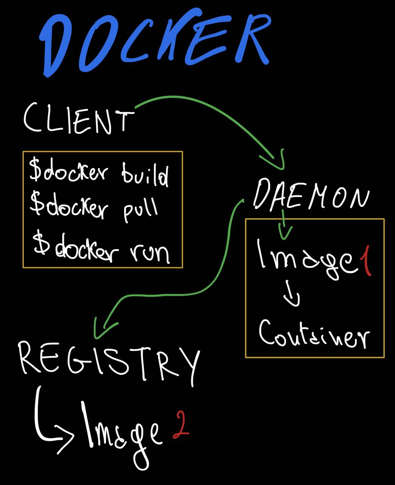

# Docker

Docker provides the ability to package and run an application in a loosely isolated environment called a **container**.
    
- Containers are lightweight and contain everything needed to run the application, so you do not need to rely on what is currently installed on the host

## Architecture
Docker uses the client-server paradigm
    
- Client talks with Docker daemon (which does the heavy lifting of building, running and distributing your Docker container).
- Client and daemon can run on the same machine or different computer, comminicating with REST API over UNIX socket or network interface.

**Docker compose**: A Docker client which allows you to work with applications consisting of a set of containers.

**Docker daemon**: aka dockerd, listens for a Docker API request and manage Docker objects -> containers, images, volumes, networks.
    Can also communicate with other daemon in way to manage Docker services.

**Docker client**: using 'docker run' client sends the commands to dockerd, which carries them out.
    A client can communicate with multiple daemon.

**Docker desktop**: includes Docker daemon and Docker client in a single easy to install app.
    Includes also a Docker Compose, Docker Content Trust, Kubernetes and Credential Helpers.

## Docker registry
A docker registry stores Docker images.
Docker Hub is a public registry which anyone can use, and Docker is configured to look for images in Docker Hub by default.

'docker pull' or 'docker run' required images are pulled from the configured registry.
'docker push' push the image on configured registry.

## Docker objects

### Images 
An image is a read-only template with instructions for creating a Docker container.
*An image can be based on another image, with some additional customization*

To build an own image, you need to create a Dockerfile with a simple syntax for defining the steps needed to crate te image and run it.
    - Each instruction in a Dockerfile creates a layer in the image.
    - If you change the Dockerfile and rebuild the image, only the layers whose has changed are rebuilt -> this makes images so lightweight, small and fast. 

### Containers
A container is a runnable instance of an image.
You can create, start, stop, move or delete a contaiener using Docker API or CLI.

A container can be connected to one or more networks, attach storage to it, or create a new image based on its current state.
A container is defined by its image as any configuration options you provide to it when you create or start it.

