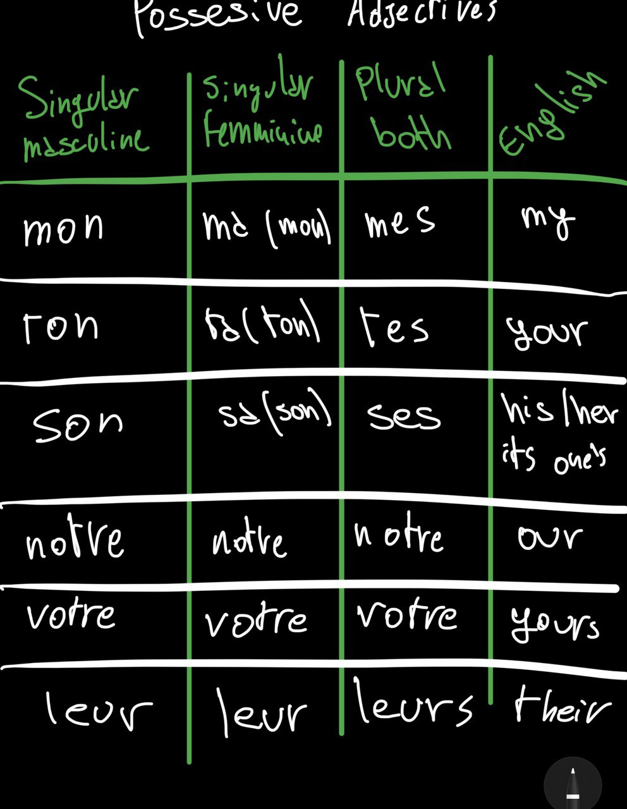

# French language

## Subjects and ponoms

Subject | Directed object | Indirected Object | Reflexive | Stressed
Je - me - moi
Tu - te - toi
il/elle/on - le/la - lui - se lui/elle/soi
nous 
vous 
ils/elles - les - leur  - se - eux/elles

Two kind of you: tu (for friends), vous (for older people/strangersd)

## Common phrases

### Greetings

- Hello - Bonjour/Salut (more informal)
- Good evening - Bonsoir 
- Nice to meet you - Enchanté

- Thank you - Merci
- Thank you very much - Merci beaucoup
- It's nothing - Il n'y a pas de quoi [ill nee ah pah duh kwah]
- Excuse me, sorry - Excusez moi, pardon
    - Pardon? Comment? [komon] (when you don't hear what someone says).
- I'm sorry - Je suis désolé
- Go ahed/go on - Vas-y [va zee]

- Congratulations - Félicitations
- Welcome - Bienvenue
- Happy birthday - Joyeux anniversaire
- Happy new year - Bonne année
- Goodbye - Au revoir
- Good day - Bonne journée
- Good night - Bonne nuit
- See you soon - À bientôt 
- See you tomorrow - À demain 

### Basic

- How are yoy? - Ça va? / Comment tu vas?
- How's it going? - Ça roule?
- I'm good - Ça va bien.
- An you? - Et toi?
- How's work? - Ça va le travail?
- What's your job? - C'est quoi ton travail?

### Basic dealing w/ problems

- Can you? - Pouvez-vous? [poo vay voo]
- Can you speak slowly please? - Pouvez vous parlez plus lentament s'il vous plaît?
- Can you repeat it please? - Pouvez vous le répéter s'il vous plaît?
- Can you help me? - Pouvez-vous m'aider[mayday] s'il vous plaît?
- I don't understand - Je ne comprendes pas [juh nuh compron pah]
- I dind't understand - Je n'ai rien compris[compree]
- I don't speak much french - Je ne parle pas français 
- I'm lost - Je suis perdu [pair doo]
- What does that mean? - Qu'est-ce que ça veut dire? [kess kuh sa vuh deer]
- Do you speak English? - Parlez-vous anglais?
- I don't feel very well - Je ne me sens pas très bien
- I'm ill/sick - Je suis malade[ma lad]
- I feel like vomiting - J'ai envie de vomir[jay onvee duh vomeer]
- Careful/Be careful - Attention! Fais attention
- Help - Au secours[oh sucoor]

### Question words

- What? - Quoi?[kwah]
- When? - Quand?[kon]
- Who? - Qui?[kee]
- How? - Comment?[komon]
- How many? - Combien?[kom byan]
- Where? - Où?[oo]
- Why? - Pourquoi?[pour kwah]
- Which? - Quel/quelle/quels/quelles?[kell->for each]

### Common questions

- What's your name? - Comment tu t'apelles?
- How old are you? - Quel âge as-tu? 
- What's time is it? - Quelle heure est-it?
- How much is it? - C'est combien? [say kombyan]
- Where do you come from? - Tu viens d'où?
- Do you understand? - Tu comprendes? [too kompron]
- Where's the toilet? - Où sont le toilette? 

### Important answers

- My name is Alberto - Je m'apelle Alberto
- I'm - Je suis
- I'm 23 years old - J'ai 23 ans
- Yes - Oui
- No - Non
- Maybe - Peut-être[puh tetr]
- Every day - tous les jours
- Sometimes - Parfois [pahrfwah]
- Never - Jamais

## Grammar

### Nouns 
Two genders: masculine and feminine.
Gender and numbers of the nouns are influence the conjugation of the article/pronouns/adjective around them.

**feminine**: ends with "-e" or "-ion"
    The exception are ending with "-age", "-ège", "-isme".

Almost every other noun ending is **masculine**

### Articles

Masculine: le/l' - les
Feminine: la/l' - les

**Ex**:
- *le cheval* (the horse)
- *l'eau* (the water)
- *la femme* (the woman)
- *le yeux* (the eyes)

Indefinite articles
- un vélo (a bike)
- un voiture (a car)

### Adjectives

(singular/plurar)
Masculine: - / -s
Femminine: -e / -es

**Ex**
- L'homme intelligent (the smart man)
- La femme intelligente (the smart woman)
- L'hommes intelligents (the smart men)
- la femmes intelligentes (the smart women)

### Possessive adjective

## Sentence structure

Like english: SVO (Subject Verbs Object) structures.
*eg*: I eat apple -> Je mange des pommes

### Common question words
- How -> Comment
- What -> Que / Qu'est-ce que que
- What kind -> Quel genre
- When -> Quand
- Where -> Où
- Why -> Pourquoi

For a question you can also changing the order of the verb and pronoun, and connect them with a hypen:
*eg*: Can you help up? -> Pouvez-vous nous aider?

### Conjunction

#### Coordinating conjunction
- and -> et
- because -> parce que
- then -> puis
- or -> ou
- but -> mais

#### Subordinating conjunction
- if -> si
- since -> comme
- that -> que

